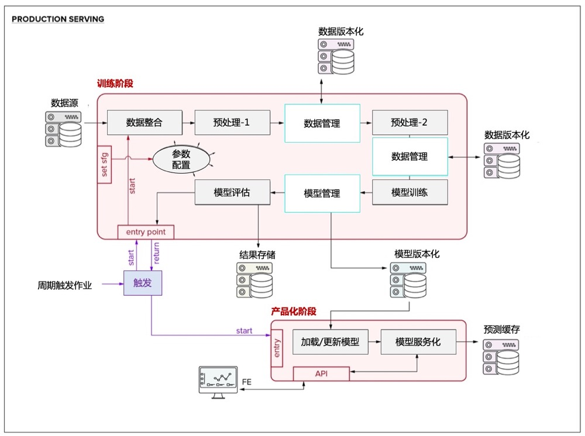

---

  <a href="https://algolink.cloud">algolink.cloud</a> •
  <a href="https://docs.algolink.cloud">docs.algolink.cloud</a> •
  <a href="#quickstart">Quickstart</a> •
  <a href="https://algolink.cloud/slack-invite/">Join Slack</a>

 

# bandit-recom
通过AI驱动的推荐，提高客户满意度和消费。适用于您的主页、产品详情、电子邮件营销活动等。帮助企业快速搭建推荐系统，为用户提供千人千面的个性化体验，解决信息过载与用户注意力有限之间的矛盾，将每一次曝光价值最大化

## 核心技术

- 数据自适应
  - 基于协作式和基于内容的过滤算法的个性化。
- 模型可实时更新
  - 实时为您的个人用户在每一个时点上进行个性化定制。
- 快速整合到您的业务系统
  - 通过我们完善的文档和易于使用的API、SDK快速集成。
  - 快速、简单的集成即可融入您的环境
- AI驱动的A/B测试
  - 为了随时保持最大的KPI，应用AutoML AI来优化算法合集。
- 支持业务规则配置
  - 我们的解决方案可以通过助推器或过滤器快速、轻松地添加任何业务规则。
- 内嵌AI算法模块
  - 深度神经网络的模块化有助于根据历史行为预测下一步行动。

## 支持的模型、策略及特征类型

当前支持的模型列表:

- Contextual Bandits (small datasets)
  - [x] Linear bandit w/ ε-greedy exploration
  - [x] Random forest bandit w/ ε-greedy exploration
  - [x] Gradient boosted decision tree bandit w/ ε-greedy exploration
- Contextual Bandits (medium datasets)
  - [x] Neural bandit with ε-greedy exploration
  - [x] Neural bandit with UCB-based exploration [(via. dropout exploration)](https://arxiv.org/abs/1506.02142)
  - [x] Neural bandit with UCB-based exploration [(via. mixture density networks)](https://publications.aston.ac.uk/id/eprint/373/1/NCRG_94_004.pdf)
- Reinforcement Learning (large datasets)
  - [ ] [Deep Q-learning with ε-greedy exploration](https://www.cs.toronto.edu/~vmnih/docs/dqn.pdf)
  - [ ] [Quantile regression DQN with UCB-based exploration](https://arxiv.org/abs/1710.10044)
  - [ ] [Soft Actor-Critic](https://arxiv.org/abs/1801.01290)

<b>4</b> 支持的特征类型:
* <b>Numeric:</b> standard floating point features
  * e.g. `{totalCartValue: 39.99}`
* <b>Categorical:</b> low-cardinality discrete features
  * e.g. `{currentlyViewingCategory: "men's jeans"}`
* <b>ID list:</b> high-cardinality discrete features
  * e.g. `{productsInCart: ["productId022", "productId109"...]}`
  * Handled via. learned embedding tables
* <b>"Dense" ID list:</b> high-cardinality discrete features, manually mapped to dense feature vectors
  * e.g `{productId022: [0.5, 1.3, ...], productId109: [1.9, 0.1, ...], ...}`

## 技术架构

bandit-recom技术架构：
